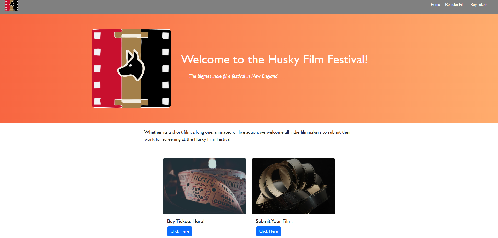
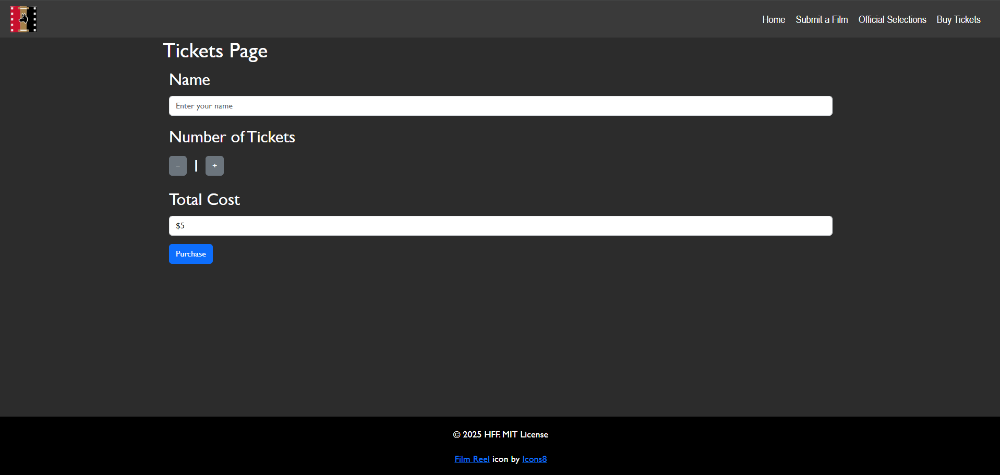
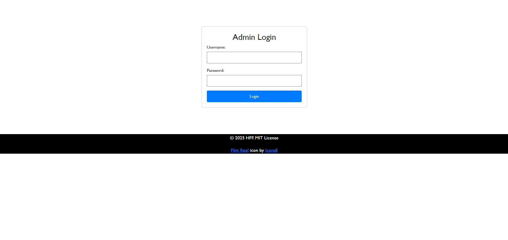
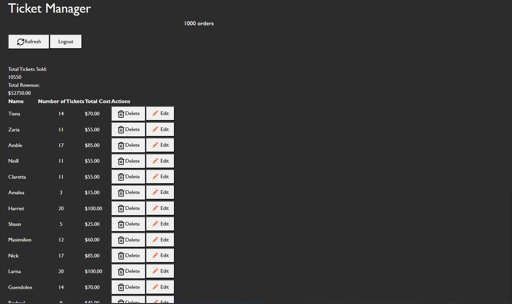

# HuskyFilmFestival

## Authors
Margaret Bertoni, Utkarsh Dev

## Class Link
[WebDev Class](https://johnguerra.co/classes/webDevelopment_online_fall_2025/)

## Project Objective
HuskyFilmFestival is a full-stack web application that allows filmmakers to submit their films for screening consideration and enables users to purchase tickets for the festival. Built with React, Node.js, Express, and MongoDB, the platform provides a seamless experience for both creators and attendees.

An admin dashboard allows authorized users to log in, review submissions, and manage customer purchases, including editing or deleting records as needed. The project showcases a complete integration of front-end and back-end technologies to create a dynamic, responsive, and secure event management platform.

## Screenshots

### Home Page

### Ticket Form

### Admin Login

### Admin Ticket Management

## Tools used
- React (frontend) 
- Node.js (backend)
- Express (server)
- MongoDB (database)
- nodemon (dev)
- ESLint, Prettier (code quality/formatting)

## Project Structure
- backend.js                 - main Express server (entry)
- package.json               - project metadata & scripts
- node_modules/              - installed packages
- public/ or client/         - frontend assets (Created by React)
- screenshots/               
- README.md                  
(Adjust paths if your repo organizes differently.)

## Instructions to build =
Prerequisites:
- Node.js (v18+ recommended)
- npm
- MongoDB running locally or a cloud URI

1. Clone the repo and open the project folder:
   - git clone <repo-url>
   - cd HuskyFilmFestival

2. Install dependencies:
   - npm install

3. Configure environment:
   - Set MONGO_URI (e.g. export MONGO_URI="mongodb://localhost:27017/huskyfilm")
   - Optionally create a .env file and load it in your backend if implemented.

4. Start the backend server (uses nodemon):
   - npm start
   - By default this runs nodemon and watches backend.js; visit http://localhost:3000 (or the port your backend uses).

5. Frontend :
   - cd frontend
   - npm install
   - npm start
   - For production build: npm run build (then serve the build folder with a static server)

Notes:
- If your server uses a different port or script, update the commands accordingly.
- Ensure MongoDB is reachable using the MONGO_URI you configured.

## AI Usage
This README was created/edited with assistance from GitHub Copilot (GPT-5 mini)
